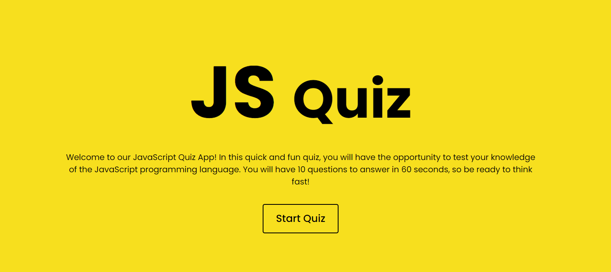

# JavaScript Quiz

## Description
This is a JavaScript-based quiz application that allows users to test their knowledge on a variety of topics. The motivation behind building this project was to create an interactive and engaging way for users to learn and test their knowledge. The problem it solves is providing an alternative to traditional methods of learning, such as reading and taking notes. Through building this project, I learned about JavaScript functions and event handling, as well as working with the local storage.

## Table of contents
- Installation
- Usage
- Credits
- License

## Installation
To install this project, simply clone the repository and open the index.html file in a web browser. No additional setup is required.

## Usage
1. Press the "Start" button to begin the quiz.
2. Read the rules and press "Continue" to begin the quiz.
3. A timer of 60 seconds will start counting down.
4. You will be presented with 10 multiple-choice questions, each with 4 options.
5. Select the correct answer before the timer runs out.
6. If you answer correctly, you will earn 1 point.
7. If you answer incorrectly, 5 seconds will be subtracted from the timer.
8. Once the quiz is completed, you can save your name and score to the local storage.
9. You can also delete your details and go to start screen.

## Credits
This project was design and created by Ainhoa Prada.

## License
Mit License.